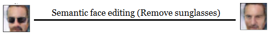

# pytorch-dl-course-project

Course project for "Deep Learning" at University of Oulu, 2020

# Abstract

This study aims to provide insight to the inner workings of the Deep Convolutional Adversial Network (DCGAN) by reviewing how it works and demonstrating an implementation on the CELEBA dataset. Furthermore, some of the problems that may arise when training the model are discussed and a handful of experimental methods that alleviate the problems are demonstrated. Lastly, editing of high-level features of a generated image is explored by manipulating latent vectors.
